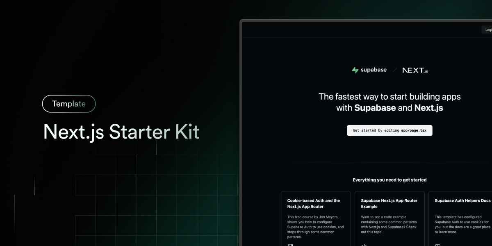

# ALTERNA Light Dashboard

投資機会の定点観測を行うNext.js + Supabase アプリケーション

<p align="center">
  
</p>

## 🎯 プロジェクト概要

ALTERNA Light Dashboardは、MDMのALTERNA digital securitiesサービスから投資機会情報とパフォーマンスデータを監視するためのダッシュボードアプリケーションです。

### 主要機能

- **📈 ニュースタイムライン**: 投資案件の最新情報を時系列で表示
  - 新着案件、償還情報、運用結果の分類表示
  - 想定利回り、最低投資額、申込方式の表示
  - 外部リンクによる詳細情報アクセス

- **📸 スナップショット表示**: 投資機会のスクリーンショット画像管理
  - セキュアな署名付きURL経由での画像表示
  - グリッドレイアウトによる一覧表示
  - 元ページへの直接リンク機能

## 🚀 技術スタック

### Frontend
- **Next.js 15** - App Router with React Server Components
- **TypeScript** - 型安全な開発環境
- **Tailwind CSS** - ユーティリティファーストCSSフレームワーク
- **shadcn/ui** - アクセシブルUIコンポーネント
- **React Query** - サーバー状態管理とキャッシング

### Backend
- **Supabase** - フルスタックBaaSプラットフォーム
  - PostgreSQL - メインデータベース
  - Row Level Security - セキュリティポリシー
  - Storage - プライベート画像ストレージ
  - Edge Functions - サーバーレスファンクション

### 開発・デプロイ
- **GitHub Codespaces** - クラウド開発環境
- **Vercel** - 本番デプロイプラットフォーム

## 🏗️ アーキテクチャ

### セキュリティ設計
- **Service Role分離**: クライアント/サーバー間の適切な権限管理
- **署名付きURL**: 1時間有効期限のプライベート画像アクセス
- **RLS (Row Level Security)**: テーブルレベルでのアクセス制御
- **環境変数管理**: GitHub Secrets経由の安全な設定管理

### データフロー
```
ユーザー → Next.js App → API Routes → Supabase Client → PostgreSQL/Storage
                     ↘ React Query ↗
```

## 🛠️ 開発環境セットアップ

### 前提条件
- Node.js 18以上
- Supabaseプロジェクト
- GitHub Codespaces または ローカル開発環境

### 環境変数設定

GitHub Codespaces Secretsまたは `.env.local` に以下を設定:

```bash
# 公開環境変数 (クライアント側で使用可能)
NEXT_PUBLIC_SUPABASE_URL=your-supabase-project-url
NEXT_PUBLIC_SUPABASE_ANON_KEY=your-supabase-anon-key

# プライベート環境変数 (サーバー専用)
SUPABASE_SERVICE_ROLE_KEY=your-supabase-service-role-key
```

### インストール・起動

```bash
# 依存関係インストール
npm install

# 開発サーバー起動 (Turbopack使用)
npm run dev

# 本番ビルド
npm run build

# 本番サーバー起動
npm start

# リンティング
npm run lint
```

## 📁 プロジェクト構成

```
├── app/                    # Next.js App Router
│   ├── api/               # API エンドポイント
│   │   ├── news/          # ニュースデータAPI
│   │   └── snapshots/     # スナップショット署名付きURL API
│   ├── snapshots/         # スナップショット表示ページ
│   └── layout.tsx         # ルートレイアウト
├── components/            # Reactコンポーネント
│   ├── ui/                # shadcn/ui ベースコンポーネント
│   ├── news-timeline.tsx  # ニュース一覧
│   ├── news-card.tsx      # ニュースカード
│   ├── snapshot-grid.tsx  # スナップショットグリッド
│   └── navigation.tsx     # タブナビゲーション
├── hooks/                 # カスタムReactフック
│   ├── useNews.ts         # ニュースデータフェッチ
│   └── useSnapshots.ts    # スナップショットデータフェッチ
├── lib/                   # ユーティリティライブラリ
│   ├── supabase/          # Supabaseクライアント設定
│   ├── types.ts           # TypeScript型定義
│   ├── constants.ts       # アプリケーション定数
│   └── utils.ts           # ヘルパー関数
└── CLAUDE.md             # AI開発アシスタント向け設定
```

## 🗃️ データベーススキーマ

### メインテーブル
- **`al_tr_events`** - 投資ニュース・イベント情報
- **`al_tr_performance`** - パフォーマンス追跡データ
- **`al_offering_snaps`** - プライベートスナップショット管理

### セキュリティポリシー
- 📰 ニューステーブル: 匿名SELECT許可
- 📸 スナップショットテーブル: Service roleのみアクセス
- 🔒 ストレージバケット: プライベート設定、署名付きURLアクセス

## 🎨 UI/UX特徴

### レスポンシブデザイン
- **モバイルファースト**: スマートフォン最適化
- **タブレット対応**: 中間画面サイズ最適化
- **デスクトップ**: 大画面での効率的表示

### インタラクションデザイン
- **ローディング状態**: スケルトンUI表示
- **エラーハンドリング**: 再試行機能付きエラー表示
- **ホバーエフェクト**: カード要素のインタラクティブ表示
- **ダークモード**: システム設定連動テーマ切り替え

## 🔐 セキュリティ考慮事項

### データアクセス制御
- Supabase RLS によるテーブルレベルセキュリティ
- Service Role Key の適切な管理
- クライアント露出防止の `server-only` 実装

### 画像セキュリティ
- プライベートStorageバケット使用
- 1時間有効期限の署名付きURL
- 直接アクセス不可の画像保護

## 📊 パフォーマンス最適化

### キャッシング戦略
- **React Query**: 5分間ステイルタイム、10分間キャッシュ保持
- **Next.js Image**: 自動画像最適化と遅延読み込み
- **15分間隔**: 自動データ更新間隔

### バンドル最適化
- **Turbopack**: 高速開発サーバー
- **Tree Shaking**: 未使用コード除去
- **Code Splitting**: ページ単位の動的インポート

## 🚀 デプロイ

### Vercel デプロイ

```bash
# Vercel CLI使用
vercel --prod

# または GitHub連携による自動デプロイ
```

### 環境設定
本番環境では以下の環境変数が必要:
- `NEXT_PUBLIC_SUPABASE_URL`
- `NEXT_PUBLIC_SUPABASE_ANON_KEY`
- `SUPABASE_SERVICE_ROLE_KEY`

## 🧪 テスト (予定)

### 単体テスト
- Jest + React Testing Library
- コンポーネント単体テスト
- カスタムフック テスト

### E2Eテスト
- Playwright使用
- 主要ユーザージャーニーテスト
- レスポンシブ表示テスト

## 📈 今後の拡張予定

### フィルタリング機能
- イベント種別フィルタ
- 日付範囲フィルタ
- 申込方式フィルタ
- URLパラメータ連動

### 追加機能
- 通知システム
- データエクスポート
- 詳細分析ダッシュボード
- PWA対応

## 🤝 コントリビューション

このプロジェクトは内部開発プロジェクトです。開発に関する質問や提案があれば、開発チームまでご連絡ください。

## 📄 ライセンス

All rights reserved. Internal project.

---

**🎯 ステータス**: 完全動作可能状態 - 本番環境デプロイ準備完了

**📅 最終更新**: 2025-09-13
**🔧 開発環境**: GitHub Codespaces + Next.js 15 + Supabase
**🤖 開発アシスタント**: Claude Code