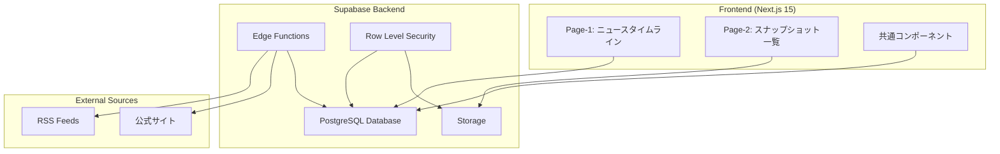
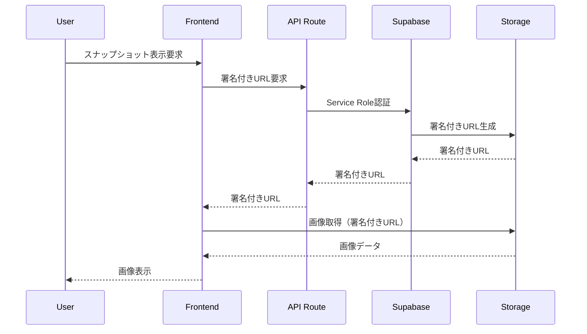

# 設計文書

## 概要

ALTERNAライト版ダッシュボードは、Next.js 15とSupabaseを活用したモダンなWebアプリケーションとして設計される。本システムは、RSS/公式ソースからの自動データ収集、セキュアなデータ管理、レスポンシブなユーザーインターフェースを提供する。

### 設計原則
- **低保守運用**: 自動化されたデータ収集とエラーハンドリング
- **セキュリティファースト**: RLS、署名付きURL、プライベートストレージの活用
- **法的コンプライアンス**: robots.txt、利用規約、著作権の厳格な遵守
- **ユーザビリティ**: 直感的なナビゲーションとレスポンシブデザイン

## アーキテクチャ

### システム全体構成



### 技術スタック

#### フロントエンド
- **Framework**: Next.js 15 (App Router)
- **Language**: TypeScript
- **Styling**: Tailwind CSS
- **State Management**: React Query (TanStack Query)
- **UI Components**: Headless UI / Radix UI

#### バックエンド
- **Database**: Supabase PostgreSQL
- **Authentication**: Supabase Auth (匿名アクセス)
- **Storage**: Supabase Storage
- **Functions**: Supabase Edge Functions
- **Scheduler**: Supabase Cron

#### 外部サービス
- **RSS Parser**: Edge Function内でのXMLパース
- **Image Processing**: 必要に応じてSupabase Storage内で処理

## コンポーネントと インターフェース

### フロントエンドコンポーネント構成

```
src/
├── app/
│   ├── layout.tsx              # ルートレイアウト
│   ├── page.tsx               # ホーム（ニュースタイムライン）
│   ├── snapshots/
│   │   └── page.tsx           # スナップショット一覧
│   └── api/
│       └── snapshots/
│           └── route.ts       # 署名付きURL生成API
├── components/
│   ├── ui/                    # 基本UIコンポーネント
│   ├── NewsTimeline.tsx       # ニュースタイムライン
│   ├── NewsCard.tsx          # ニュースカード
│   ├── SnapshotGrid.tsx      # スナップショットグリッド
│   ├── FilterPanel.tsx       # フィルタパネル
│   └── Navigation.tsx        # ナビゲーション
├── lib/
│   ├── supabase/
│   │   ├── client.ts         # クライアント用Supabaseクライアント
│   │   └── service-role.ts   # サーバー専用Service Roleクライアント
│   ├── types.ts              # 型定義
│   ├── constants.ts          # 定数定義（イベント種別、申込方式）
│   └── utils.ts              # ユーティリティ関数
└── hooks/
    ├── useNews.ts            # ニュースデータフック
    └── useSnapshots.ts       # スナップショットデータフック
```

### バックエンドコンポーネント構成

```
supabase/
├── functions/
│   ├── fetch-feeds/
│   │   └── index.ts          # RSS取得Edge Function
│   └── generate-signed-urls/
│       └── index.ts          # 署名付きURL生成
├── migrations/
│   ├── 001_initial_schema.sql
│   ├── 002_rls_policies.sql
│   └── 003_storage_setup.sql
└── config.toml               # Supabase設定
```

## データモデル

### データベーススキーマ

#### ニュース関連テーブル

```sql
-- RSS生データ保存（実装実績に合わせて修正）
CREATE TABLE sources_raw (
    id UUID PRIMARY KEY DEFAULT gen_random_uuid(),
    source TEXT NOT NULL,
    url TEXT NOT NULL,
    title TEXT,
    content JSONB NOT NULL,
    published_at TIMESTAMPTZ,
    fetched_at TIMESTAMPTZ NOT NULL DEFAULT now(),
    status TEXT NOT NULL DEFAULT 'pending'
);

-- イベント情報正規化（実装実績に合わせて修正）
CREATE TABLE al_tr_events (
    id UUID PRIMARY KEY DEFAULT gen_random_uuid(),
    url TEXT NOT NULL UNIQUE, -- URL列追加、一意制約
    title TEXT NOT NULL,
    description TEXT,
    event_type TEXT NOT NULL CHECK (event_type IN ('NEW_LISTING', 'REDEMPTION', 'RESULT', 'REVIEW')),
    subscription_method TEXT CHECK (subscription_method IN ('FCFS', 'DRAW')),
    expected_yield DECIMAL(5,2),
    minimum_investment BIGINT,
    deadline TIMESTAMPTZ,
    published_at TIMESTAMPTZ NOT NULL,
    created_at TIMESTAMPTZ NOT NULL DEFAULT now()
);

-- イベント種別の説明
COMMENT ON COLUMN al_tr_events.event_type IS 'NEW_LISTING: 新着案件, REDEMPTION: 償還・分配, RESULT: 抽選・運用結果, REVIEW: 評判・レビュー';
COMMENT ON COLUMN al_tr_events.subscription_method IS 'FCFS: 先着順, DRAW: 抽選方式';

-- パフォーマンス実績
CREATE TABLE al_tr_performance (
    id UUID PRIMARY KEY DEFAULT gen_random_uuid(),
    product_name TEXT NOT NULL,
    return_rate DECIMAL(5,2),
    period_start DATE,
    period_end DATE,
    distribution_amount DECIMAL(15,2),
    source_url TEXT NOT NULL,
    recorded_at TIMESTAMPTZ NOT NULL DEFAULT now()
);
```

#### スナップショット管理テーブル

```sql
CREATE TABLE al_offering_snaps (
    id UUID PRIMARY KEY DEFAULT gen_random_uuid(),
    url TEXT NOT NULL,
    image_path TEXT NOT NULL, -- Storageの相対パス
    title TEXT,
    note TEXT,
    captured_at TIMESTAMPTZ NOT NULL DEFAULT now(),
    UNIQUE (url, image_path)
);
```

#### パフォーマンス最適化インデックス

```sql
-- 主要クエリパターンに基づくインデックス設計
CREATE INDEX IF NOT EXISTS al_tr_events_published_idx ON public.al_tr_events(published_at DESC);
CREATE INDEX IF NOT EXISTS al_tr_events_event_type_idx ON public.al_tr_events(event_type);
CREATE INDEX IF NOT EXISTS al_offering_snaps_captured_idx ON public.al_offering_snaps(captured_at DESC);
CREATE INDEX IF NOT EXISTS al_tr_events_url_idx ON public.al_tr_events(url);
CREATE INDEX IF NOT EXISTS sources_raw_fetched_idx ON public.sources_raw(fetched_at DESC);
```

### Row Level Security (RLS) ポリシー

```sql
-- ニュース系テーブル: 匿名読み取り許可
ALTER TABLE al_tr_events ENABLE ROW LEVEL SECURITY;
CREATE POLICY "Allow anonymous select" ON al_tr_events
    FOR SELECT USING (true);

ALTER TABLE al_tr_performance ENABLE ROW LEVEL SECURITY;
CREATE POLICY "Allow anonymous select" ON al_tr_performance
    FOR SELECT USING (true);

-- スナップショットテーブル: 完全プライベート
ALTER TABLE al_offering_snaps ENABLE ROW LEVEL SECURITY;
-- SELECTポリシーは作成しない（Service Role経由のみ）
```

### Storage設定

```sql
-- プライベートバケット作成
INSERT INTO storage.buckets (id, name, public) 
VALUES ('snapshots', 'snapshots', false);

-- Service Roleのみアクセス許可（バケット限定）
CREATE POLICY "Service role access snapshots" ON storage.objects
    FOR ALL USING (
        auth.role() = 'service_role' 
        AND bucket_id = 'snapshots'
    );

-- 署名付きURL生成用ポリシー（バケット限定）
CREATE POLICY "Service role select snapshots" ON storage.objects
    FOR SELECT USING (
        auth.role() = 'service_role' 
        AND bucket_id = 'snapshots'
    );
```

**セキュリティ強化**:
- バケット限定条件（`bucket_id = 'snapshots'`）を追加
- 他のバケットへの意図しないアクセスを防止
- 最小権限の原則に従った設計

## エラーハンドリング

### フロントエンドエラーハンドリング

```typescript
// エラー境界コンポーネント
class ErrorBoundary extends React.Component {
  // エラー状態管理とフォールバックUI
}

// APIエラーハンドリング
const useNewsWithErrorHandling = () => {
  return useQuery({
    queryKey: ['news'],
    queryFn: fetchNews,
    retry: 3,
    retryDelay: attemptIndex => Math.min(1000 * 2 ** attemptIndex, 30000),
    onError: (error) => {
      console.error('News fetch failed:', error);
      // ユーザー向けエラー表示
    }
  });
};
```

### バックエンドエラーハンドリング

```typescript
// Edge Function内でのエラーハンドリング
export default async function handler(req: Request) {
  try {
    // RSS取得処理
  } catch (error) {
    console.error('RSS fetch failed:', error);
    
    // Supabaseにエラーログ保存
    await supabase
      .from('error_logs')
      .insert({
        function_name: 'fetch-feeds',
        error_message: error.message,
        occurred_at: new Date().toISOString()
      });
    
    // 部分的な成功でも継続
    return new Response(JSON.stringify({ 
      status: 'partial_success',
      errors: [error.message] 
    }), {
      status: 200,
      headers: { 'Content-Type': 'application/json' }
    });
  }
}
```

## テスト戦略

### フロントエンドテスト

```typescript
// コンポーネントテスト (Jest + React Testing Library)
describe('NewsTimeline', () => {
  test('displays news items correctly', () => {
    // テストケース実装
  });
  
  test('handles loading state', () => {
    // ローディング状態テスト
  });
  
  test('handles error state', () => {
    // エラー状態テスト
  });
});

// E2Eテスト (Playwright)
test('user can navigate between pages', async ({ page }) => {
  await page.goto('/');
  // app/layout.tsxのタブナビゲーションをテスト
  await page.click('[data-testid="snapshots-tab"]');
  await expect(page).toHaveURL('/snapshots');
  
  await page.click('[data-testid="news-tab"]');
  await expect(page).toHaveURL('/');
});
```

### バックエンドテスト

```typescript
// Edge Functionテスト
describe('fetch-feeds function', () => {
  test('successfully processes RSS feeds', async () => {
    // RSS処理テスト
  });
  
  test('handles malformed RSS gracefully', async () => {
    // エラーハンドリングテスト
  });
});

// データベーステスト
describe('RLS policies', () => {
  test('anonymous users can read news', async () => {
    // RLSポリシーテスト
  });
  
  test('anonymous users cannot access snapshots', async () => {
    // セキュリティテスト
  });
});
```
## セキュリテ
ィ設計

### 認証・認可アーキテクチャ



### セキュリティ実装詳細

#### 1. Service Role Key管理

```typescript
// lib/supabase/service-role.ts - サーバーサイド専用
import "server-only"; // クライアントサイドでの使用を防止
import { createClient } from '@supabase/supabase-js';

// 注意: SUPABASE_SERVICE_ROLE_KEYにはNEXT_PUBLIC_プレフィックスを絶対に付けない
export const supabaseServiceRole = createClient(
  process.env.NEXT_PUBLIC_SUPABASE_URL!, // URLは公開可
  process.env.SUPABASE_SERVICE_ROLE_KEY!, // サーバー限定の秘密
  {
    auth: {
      autoRefreshToken: false,
      persistSession: false
    }
  }
);
```

**重要**: 
- `import "server-only"`でクライアントサイドでの使用を防止
- `SUPABASE_SERVICE_ROLE_KEY`に`NEXT_PUBLIC_`プレフィックスを付けると、ビルド時にバンドルされクライアントに漏れる危険性があります

#### 2. 署名付きURL生成API

```typescript
// app/api/snapshots/route.ts
import { supabaseServiceRole } from '@/lib/supabase/service-role';

export const runtime = 'nodejs'; // Service Role使用のためNode.js runtime必須

export async function GET() {
  try {
    const { data: snapshots } = await supabaseServiceRole
      .from('al_offering_snaps')
      .select('*')
      .order('captured_at', { ascending: false });

    const snapshotsWithUrls = await Promise.all(
      snapshots.map(async (snapshot) => {
        const { data: signedUrl } = await supabaseServiceRole.storage
          .from('snapshots')
          .createSignedUrl(snapshot.image_path, 3600); // 1時間有効

        return {
          id: snapshot.id,
          url: snapshot.url,
          title: snapshot.title,
          note: snapshot.note,
          captured_at: snapshot.captured_at,
          signed_url: signedUrl?.signedUrl || null
        };
      })
    );

    return Response.json({
      ok: true,
      items: snapshotsWithUrls
    });
  } catch (error) {
    return Response.json({ 
      ok: false, 
      error: 'Failed to fetch snapshots',
      items: []
    }, { status: 500 });
  }
}
```

### API契約仕様

#### GET /api/snapshots
**レスポンス形式:**
```typescript
{
  ok: boolean;
  items: Array<{
    id: string;
    url: string;
    title: string | null;
    note: string | null;
    captured_at: string;
    signed_url: string | null;
  }>;
  error?: string; // ok: false の場合のみ
}
```

#### 3. クライアントサイドセキュリティ

```typescript
// lib/supabase/client.ts - クライアント用（ブラウザ公開OK）
import { createClient } from '@supabase/supabase-js';

export const supabase = createClient(
  process.env.NEXT_PUBLIC_SUPABASE_URL!,      // Secretsから注入
  process.env.NEXT_PUBLIC_SUPABASE_ANON_KEY!  // 公開前提のanon key
);
```

**注意**: `NEXT_PUBLIC_`プレフィックスが付いた変数はブラウザに公開されます。Supabaseのanon keyは公開前提で設計されているため問題ありません。

#### 4. 用語統一のための定数定義

```typescript
// lib/constants.ts - 用語統一とUIラベル管理
export const EVENT_TYPES = {
  NEW_LISTING: 'NEW_LISTING',
  REDEMPTION: 'REDEMPTION', 
  RESULT: 'RESULT',
  REVIEW: 'REVIEW'
} as const;

export const SUBSCRIPTION_METHODS = {
  FCFS: 'FCFS',
  DRAW: 'DRAW'
} as const;

export const EVENT_TYPE_LABELS = {
  [EVENT_TYPES.NEW_LISTING]: '新着案件',
  [EVENT_TYPES.REDEMPTION]: '償還・分配',
  [EVENT_TYPES.RESULT]: '抽選・運用結果',
  [EVENT_TYPES.REVIEW]: '評判・レビュー'
} as const;

export const SUBSCRIPTION_METHOD_LABELS = {
  [SUBSCRIPTION_METHODS.FCFS]: '先着順',
  [SUBSCRIPTION_METHODS.DRAW]: '抽選方式'
} as const;

export type EventType = typeof EVENT_TYPES[keyof typeof EVENT_TYPES];
export type SubscriptionMethod = typeof SUBSCRIPTION_METHODS[keyof typeof SUBSCRIPTION_METHODS];
```

## パフォーマンス最適化

### フロントエンド最適化

#### 1. データフェッチング戦略

```typescript
// hooks/useNews.ts
export const useNews = (filters: NewsFilters) => {
  return useQuery({
    queryKey: ['news', filters],
    queryFn: () => fetchNews(filters),
    staleTime: 5 * 60 * 1000, // 5分間キャッシュ
    cacheTime: 10 * 60 * 1000, // 10分間保持
    refetchOnWindowFocus: false,
    refetchInterval: 15 * 60 * 1000 // 15分毎に自動更新
  });
};
```

#### 2. 画像最適化

```typescript
// components/SnapshotGrid.tsx
import Image from 'next/image';

const SnapshotCard = ({ snapshot }: { snapshot: Snapshot }) => (
  <div className="relative aspect-video">
    <Image
      src={snapshot.signed_url}
      alt={snapshot.title || 'Investment snapshot'}
      fill
      className="object-cover rounded-lg"
      sizes="(max-width: 768px) 100vw, (max-width: 1200px) 50vw, 33vw"
      priority={false}
      loading="lazy"
    />
  </div>
);
```

#### 3. コード分割

```typescript
// app/snapshots/page.tsx
import dynamic from 'next/dynamic';

const SnapshotGrid = dynamic(() => import('@/components/SnapshotGrid'), {
  loading: () => <SnapshotGridSkeleton />,
  ssr: false
});
```

### バックエンド最適化

#### 1. データベースインデックス

```sql
-- パフォーマンス向上のためのインデックス（確定スキーマに基づく）
CREATE INDEX IF NOT EXISTS al_tr_events_published_idx ON public.al_tr_events(published_at DESC);
CREATE INDEX IF NOT EXISTS al_tr_events_event_type_idx ON public.al_tr_events(event_type);
CREATE INDEX IF NOT EXISTS al_offering_snaps_captured_idx ON public.al_offering_snaps(captured_at DESC);

-- 追加の有用なインデックス
CREATE INDEX IF NOT EXISTS al_tr_events_url_idx ON public.al_tr_events(url); -- UNIQUE制約があるが検索用
CREATE INDEX IF NOT EXISTS sources_raw_fetched_idx ON public.sources_raw(fetched_at DESC);
```

#### 2. Edge Function最適化

```typescript
// supabase/functions/fetch-feeds/index.ts
export default async function handler(req: Request) {
  // 並列処理でRSS取得
  const feedPromises = RSS_SOURCES.map(async (source) => {
    try {
      const response = await fetch(source.url, {
        headers: {
          'User-Agent': 'ALTERNA-Dashboard/1.0',
        },
        signal: AbortSignal.timeout(10000) // 10秒タイムアウト
      });
      
      if (!response.ok) throw new Error(`HTTP ${response.status}`);
      
      return await processFeed(await response.text(), source);
    } catch (error) {
      console.error(`Failed to fetch ${source.url}:`, error);
      return null;
    }
  });

  const results = await Promise.allSettled(feedPromises);
  // 成功した結果のみ処理
}
```

## 運用・監視

### ログ戦略

```typescript
// lib/logger.ts
export const logger = {
  info: (message: string, meta?: object) => {
    console.log(JSON.stringify({
      level: 'info',
      message,
      timestamp: new Date().toISOString(),
      ...meta
    }));
  },
  
  error: (message: string, error?: Error, meta?: object) => {
    console.error(JSON.stringify({
      level: 'error',
      message,
      error: error?.message,
      stack: error?.stack,
      timestamp: new Date().toISOString(),
      ...meta
    }));
  }
};
```

### 監視指標

#### 1. アプリケーション指標
- RSS取得成功率
- API応答時間
- エラー発生率
- ユーザーセッション数

#### 2. インフラ指標
- Supabase Database接続数
- Storage使用量
- Edge Function実行時間
- 帯域幅使用量

### アラート設定

```typescript
// Edge Function内でのアラート
const ALERT_THRESHOLDS = {
  RSS_FAILURE_RATE: 0.5, // 50%以上失敗でアラート
  API_RESPONSE_TIME: 5000, // 5秒以上でアラート
};

if (failureRate > ALERT_THRESHOLDS.RSS_FAILURE_RATE) {
  // Webhook等でアラート送信
  await sendAlert({
    type: 'RSS_FAILURE_HIGH',
    message: `RSS取得失敗率が${failureRate * 100}%に達しました`,
    timestamp: new Date().toISOString()
  });
}
```

## デプロイメント戦略

### 環境構成

```
Development → Staging → Production
     ↓           ↓         ↓
  Local DB   Test DB   Prod DB
```

### CI/CD パイプライン

```yaml
# .github/workflows/ci.yml
name: CI

on: [push, pull_request]

jobs:
  build-and-test:
    runs-on: ubuntu-latest
    env:
      NEXT_PUBLIC_SUPABASE_URL: ${{ secrets.NEXT_PUBLIC_SUPABASE_URL }}
      NEXT_PUBLIC_SUPABASE_ANON_KEY: ${{ secrets.NEXT_PUBLIC_SUPABASE_ANON_KEY }}
      SUPABASE_SERVICE_ROLE_KEY: ${{ secrets.SUPABASE_SERVICE_ROLE_KEY }}
    steps:
      - uses: actions/checkout@v4
      - uses: actions/setup-node@v4
        with:
          node-version: 20
      - run: npm ci
      - run: npm run lint
      - run: npm test --if-present
      - run: npm run build

  deploy:
    needs: build-and-test
    runs-on: ubuntu-latest
    if: github.ref == 'refs/heads/main'
    steps:
      - name: Deploy to Vercel
        uses: amondnet/vercel-action@v25
        with:
          vercel-token: ${{ secrets.VERCEL_TOKEN }}
          vercel-org-id: ${{ secrets.ORG_ID }}
          vercel-project-id: ${{ secrets.PROJECT_ID }}
```

#### GitHub Actions Secrets設定
- **Settings** → **Secrets and variables** → **Actions**
- 必要なSecrets:

**公開範囲（ブラウザ露出可）:**
  - `NEXT_PUBLIC_SUPABASE_URL` - Supabaseプロジェクト URL
  - `NEXT_PUBLIC_SUPABASE_ANON_KEY` - 匿名アクセス用キー（RLS前提で安全）

**非公開範囲（サーバー専用）:**
  - `SUPABASE_SERVICE_ROLE_KEY` - 管理者権限キー（クライアント露出厳禁）

**デプロイ用:**
  - `VERCEL_TOKEN` - Vercelデプロイ用トークン
  - `ORG_ID` - Vercel組織ID
  - `PROJECT_ID` - Vercelプロジェクト ID

### 環境変数管理

#### .gitignore設定
```gitignore
# env files
.env
.env.*
!.env.example
```

#### .env.example（リポジトリにコミット）
```bash
# .env.example - 実値は空欄/ダミー

# 公開範囲（ブラウザ露出可）- NEXT_PUBLIC_プレフィックス必須
NEXT_PUBLIC_SUPABASE_URL=
NEXT_PUBLIC_SUPABASE_ANON_KEY=

# 非公開範囲（サーバー専用）- NEXT_PUBLIC_プレフィックス厳禁
SUPABASE_SERVICE_ROLE_KEY=
```

#### GitHub Codespaces設定
- **Repo** → **Settings** → **Secrets and variables** → **Codespaces**
- 以下のSecretsを登録：

**公開範囲（ブラウザ露出可）:**
  - `NEXT_PUBLIC_SUPABASE_URL`
  - `NEXT_PUBLIC_SUPABASE_ANON_KEY`

**非公開範囲（サーバー専用）:**
  - `SUPABASE_SERVICE_ROLE_KEY`

#### 本番環境（Vercel）設定
- **Project Settings** → **Environment Variables**
- 同じ変数名で設定（Secretsから注入）

**重要**: `.env.local`ファイルは絶対にGitにコミットしない

## 環境変数の動作確認手順

### 開発環境（Codespaces）での確認

1. **Secrets登録後のRebuild**
   ```bash
   # Codespace > Rebuild container で環境変数を再注入
   ```

2. **環境変数の注入確認**
   ```bash
   # シェルで確認
   printenv | grep SUPABASE
   
   # またはNodeで確認
   node -e "console.log(process.env.NEXT_PUBLIC_SUPABASE_URL)"
   ```

3. **開発サーバー起動**
   ```bash
   npm run dev
   # 環境変数追加後は必ず再起動が必要
   ```

### 本番環境での確認

1. **Vercel環境変数設定**
   - Project Settings → Environment Variables
   - 同じ変数名でSecretsを設定

2. **デプロイ後の再ビルド**
   - 環境変数変更後は必ず再デプロイ

### トラブルシューティング

- **`process.env.X`が`undefined`**: Secretsの登録確認、YAMLの`env:`設定確認
- **Service Role Keyエラー**: `NEXT_PUBLIC_`プレフィックスが付いていないか確認
- **ビルドエラー**: `NEXT_PUBLIC_*`変数がCI環境に設定されているか確認

## ルーティング設計

### 公開ページ（認証不要）
- `/` - ホーム（ニュースタイムライン）
- `/snapshots` - スナップショット一覧（署名付きURL使用で安全）

### API エンドポイント
- `GET /api/snapshots` - スナップショット一覧取得（署名付きURL付き）

### 将来の管理機能（認証必要）
- `/admin/snapshots` - スナップショット管理画面（将来実装）
- `POST /api/admin/snapshots` - スナップショット手動アップロード（将来実装）

### ナビゲーション設計
- **app/layout.tsx**: タブナビゲーション（ニュース/スナップショット）を常設
- **タブ構成**: 
  - "ニュース" → `/` 
  - "スナップショット" → `/snapshots`
- **レスポンシブ対応**: デスクトップ・モバイル両対応

**設計方針:**
- 基本機能は認証不要で利用可能
- 画像は署名付きURLで安全に配信
- 管理機能のみ認証を要求
- 全ページで一貫したナビゲーション体験

## 今後の拡張計画

### Phase 2: 機能拡張
- 管理画面の実装（`/admin/snapshots`）
- アラート機能（新着案件通知）
- データエクスポート機能

### Phase 3: 高度化
- 機械学習による情報分類
- 予測分析機能
- 他の投資商品への対応

### Phase 4: スケーラビリティ
- CDN最適化
- データベース分散
- マイクロサービス化検討